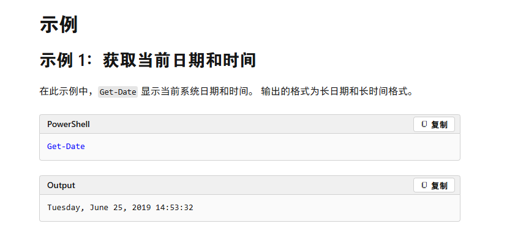
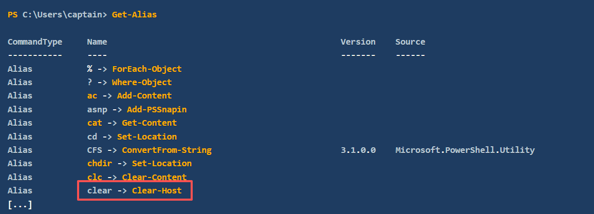
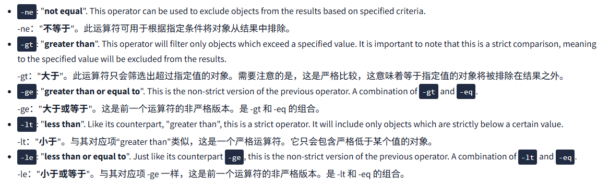
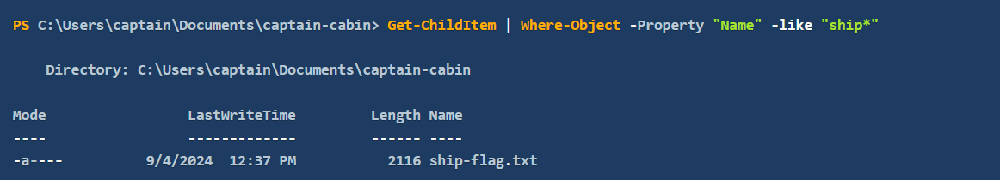
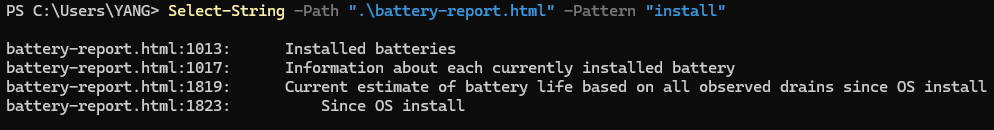
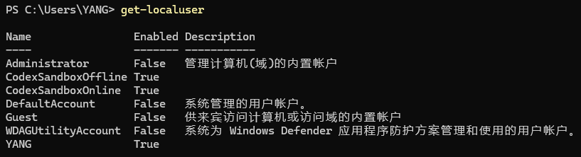

---
PowerShell命令被称为`cmdlets`（发音为`command-lets`）。它们比传统的Windows命令强大得多，并允许更高级的数据操作。
Cmdlet遵循一致的`Verb-Noun`命名约定。这种结构使得理解每个cmdlet的功能变得容易。`Verb`描述动作，`Noun`指定执行动作的对象。例如：
- `Get-Content`：检索（获取）文件内容并在控制台中显示。
- `Set-Location`：更改（设置）当前工作目录
---
## 1.基础命令

**列出当前PowerShell会话中所有可执行的cmdlet、函数、别名和脚本：**
```powershell
Get-Command
```
**列出当前PowerShell会话中所有可执行函数：**
```powershell
Get-Command -CommandType "Function"
```
**查看 cmdlet 的帮助文件`Get-Help`包括用法、参数和示例：**
```powershell
Get-Help Get-Date
```
**在线查看cmdlet 的帮助文件：**
```powershell
Get-Help Get-Date -Online
```


**列出所有可用的别名：**
```powershell
Get-Alias
```

**列出当前路径下的文件：**
```powershell
Get-ChildItem
```
```powershell
Get-item *
```
**创建并查看指定文件的备用数据流：**
```powershell
new-item ads.txt
set-content .\ads.txt -Stream hidden -Value "SlackMoon"
get-item .\ads.txt -Stream *
get-Content .\ads.txt -Stream hidden
```

**切换所在目录**：
```powershell
Set-Location -Path ".\Documents"
```
**创建文件夹：**
```powershell
New-Item -Path ".\captain-cabin\captain-wardrobe" -ItemType "Directory"
```
**创建文件：**
```powershell
New-Item -Path ".\captain-cabin\captain-wardrobe\captain-boots.txt" -ItemType "File"
```
**删除文件：**
```powershell
Remove-Item -Path ".\captain-cabin\captain-wardrobe\captain-boots.txt"
```
**复制或移动文件：**
```powershell
Copy-Item -Path .\captain-cabin\captain-hat.txt -Destination .\captain-cabin\captain-hat2.txt
```
**读取文件内容：**
```powershell
Get-Content -Path ".\captain-hat.txt"
```
**生成文件哈希:**
```powershell
Get-FileHash -Path .\ship-flag.txt
```


---
## 2.管道、过滤和排序数据
**获取目录中的文件列表并使用管道符按大小排序:**
```powershell
Get-ChildItem | Sort-Object Length
```
**获取目录中的文件列表并指定条件筛选对象:**
```powershell
Get-ChildItem | Where-Object -Property "Extension" -eq ".txt"
```
> 这里，`Where-Object` 按文件的 `Extension` 属性进行筛选，确保只列出扩展名等于（`-eq`）`.txt` 的文件。
> 运算符 `-eq`（即 "**等于**"）是一组 **比较运算符** 的一部分，这些运算符与其他脚本语言（如 Bash、Python）共享。为了展示 PowerShell 过滤的潜力，我们从该列表中选择了一些最有用的运算符：
> 


  
**通过选择匹配（`-like`）指定模式的属性来筛选对象:**
```powershell
Get-ChildItem | Where-Object -Property "Name" -like "ship*"
```

**从对象中选择特定属性或限制返回的对象数量:**
```powershell
Get-ChildItem | Select-Object Name,Length
```
![[../img/Windows_PowerShell/IMG-20260507223439614.png]]
**显示当前路径下最大的文件:**
```powershell
Get-ChildItem | Sort-Object Length -Descending | Select-Object -First 1
```
**在文件中搜索文本模式:**
```powershell
Select-String -Path ".\battery-report.html" -Pattern "install"
```

**检索当前目录中大小大于 100 的项目:**
```powershell
Get-ChildItem | Where-Object -Property Length -gt 100
```
---
## 3.系统和网络信息
**全面检索系统信息，包括操作系统信息、硬件规格、BIOS 详细信息等：**
```powershell
Get-ComputerInfo
```
**列出系统上的所有本地用户账户。默认输出会为每个用户显示用户名、账户状态和描述:**
```powershell
Get-LocalUser
```


**提供有关系统网络接口的详细信息，包括 IP 地址、DNS 服务器和网关配置：**
```powershell
Get-NetIPConfiguration
```
**显示系统上配置的所有 IP 地址的详细信息：**
```powershell
Get-NetIPAddress
```
**显示当前的 TCP 连接:**
```powershell
Get-NetTCPConnection
```
